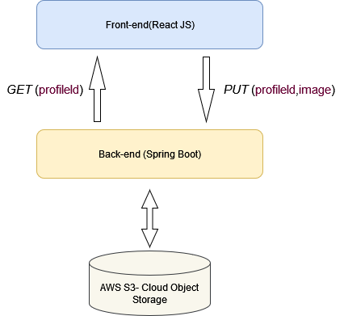

# aws-S3-key-Object

REST endpoint for putting and extracting key-image pairs into aws S3-cloud object storage.

1.npm install at src/main/frontend   
2.configure aws credentials at src/main/java/com/qwert/awstest/awsConfig/AmazonConfig.java   
3.configure aws bucket name at src/main/java/com/qwert/awstest/bucket/BucketName.java   
4.start springboot application   
5.start react app   
